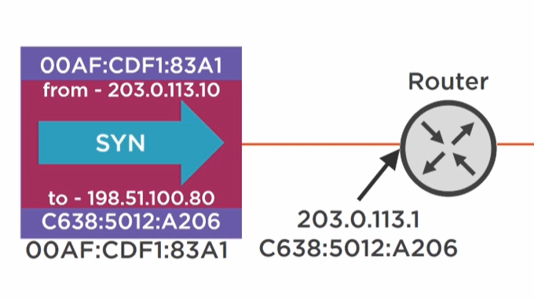

# Introduction to Networking

## Protocol

is a set of rules used to move data between two or more computers.

## Communtication Model

Method of organizing inforamtion transfer into components.

|       | | OSI |
| ----------- | ----------- | ----------- |
| Media       | wire/radio/glass       | Physical |
| Local   | Ethernet        | Data Link |
| Global   | Internet Protocol IP        | Network |
| Cues  | TCP        | Transport |
| Data   | Website/Mail        | Application |

## Cues - Transmission Control Protocol (TCP)

### Cues is for Setup/Teardown of a connection

### Three-way handshake for establishing a session for data transmission

- Fisrt you sent SYN (for synchronization) you tell the website I want to establish a connection to transfer data.
- Then you sent SYN-ACK (for synchronization and acknowledgment) to acknowledge the connection (I am available for connection).
- Then you sent ACK (for acknowledgment) to acknowledge the connection (Ok Iam about to send data).
- Then you sent data to transfer data.

## Global - Internet Protocol (IP)

- We Wrap the SYN with source(from) and destination(to) IP address.
- Same applies for SYN-AKC and ACK.

## Local - Ethernet

- we use MAC address to identify a device.
- MAC address is a unique identifier for a device (Local Communication).
- To make a connection to a global address first we wrap the SYN with from , to , my MAC address and router MAC address (The device responsible for reachout the global internet)(The default Gateway).

## Encapsulation

### What actually happens when user tries to access website

Remember OSI Model let's start investigating the layers of the network in reversed orerder.

### 7- Application Layer

- The user want to go to pluralsight.com.
- The website here represents a chunk of data.
- But the data can be very big so we split it into multiple chunks.
- Assume we took one chunk of it to send it to the requesting user

### 4- Trasport Layer

- It's much more like envelop we add headers to the data chuck
- The website chunk is added to PayLoad section
- And some headers like (Source port , Dest Port , Flags , #Seq , # ACK , PayLoad)
- We call this envlop (Sgement)
- <b>The Segment:</b> is chunk of data with transport layer headers.

### 3- Network Layer

- It's much more like a packet we add headers to the data chuck
- The website chunk is added to PayLoad section
- And some headers like (Source IP , Dest IP , TTL ,Other , PayLoad) -> Network layer headers.
- <b>The Packet:</b> is chunk of data with network layer headers.

### 2- Data Link Layer

- It's much more like a frame we add headers to the data chuck
- The website chunk is added to PayLoad section
- And some headers like (Source MAC , Dest MAC , PayLoad) -> Data Link layer headers.
- <b>The Frame:</b> is chunk of data with data link layer headers.

### 1- Physical Layer

- Convert the data into bits and send it to the destination.

### To Summarize:

- Segment: Transport Layer Header + data
- Packet: Network Layer Header + data  (Internet Layer - TCP/IP)
- Frame: Data Link Layer Header + data (Network Interface Layer - TCP/IP)

This repo contains my notes for Cisco CCNA: Cisco Certified Network Associate (CCNA 200-301) course from PluralSight  https://app.pluralsight.com/paths/certificate/cisco-ccna-cisco-certified-network-associate-200-301